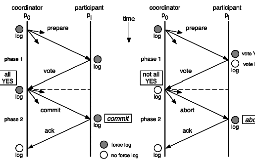

# 聊聊分布式，再说说解决方案

## 本地数据库事务
本地事务数据库断电的情况下，它是怎么保证数据一致性的呢？

我们知道我们在使用SQL Server数据库是由两个文件组成的，一个数据库文件和一个日志文件，通常情况下，日志文件都要比数据库文件大很多。数据库进行任何写入操作的时候都是要先写日志的，同样的道理，我们在执行事务的时候首先会记录下这个事务redo操作日志，然后才开始真正操作数据库，在操作之前首先会把日志文件写入磁盘，那么当突然断电的时候，即使操作没有完成，在重新启动数据库时候，数据库会根据当前数据的情况进行undo回滚或者是redo前滚，这样就保证了数据库的强一致性。

## 分布式理论
当我们的单个数据库的性能产生瓶颈的时候，我们可能会对数据库进行分区，这里所说的分区指的是物理分区，分区之后可能不同的库就处于不同的服务器上了，这个时候单个数据库的ACID已经不能适应这种情况了，这个时候如果再追集群的ACID会导致我们的系统变得很差，这时我们就需要引入一个新的理论原则来适应这种集群的情况，就是CAP原则或者叫CAP定理。
### CAP定理
CAP定理是由加州大学伯克利分校Eric Brewer教授提出来的，他指出WEB服务无法同时满足以下3个属性：
- 一致性（Consistency）：客户端知道一系列的操作都会同时发生（生效）
- 可用性（Availability）：每个操作都必须以可预期的响应结束
- 分区容错性（Partition tolerance）：即使出现单个组件无法可用，操作依然可用完成
具体地讲在分布式系统中，在任何数据库设计中，一个Web应用至多只能同时支持上面的两个属性。显然，任何横向扩展策略都要依赖于数据分区。因此，设计人员必须在一致性与可用性之间做出选择。

这个定理在至今为止的分布式系统中都是适用的！！！ exp：两阶段提交（XA Transactions）
MySQL从5.5版本开始支持，SQL Server 2005 Oracle7 开始支持 XA
其中，XA是一个两阶段提交协议，该协议分为以下两个阶段：

- 第一阶段：事务协调器要求每个涉及到事务的数据库预提交（precommit）此操作，并反映是否可以提交。
- 第二阶段：事务协调器要求每个数据库提交数据。
其中，如果有任何一个数据库否决此次提交，那么所有的数据库都会被要求回滚它们在此事务中的那部分信息，这样做的缺陷是什么？咋看之下我们可以在数据库分区之间获得一致性。
如果CAP定理是对的，那么它一定会影响到可用性。
如果说系统的可用性代表的是执行某项操作相关所有组件的可用性的和。那么在两阶段提交的过程中，可用性就代表了涉及到的每一个数据库中可用性的和。我们假设两阶段提交的过程中每一个数据库都具有99.9%的可用性，那么如果两阶段提交涉及到两个数据库，这个是结果就是99.8%，根据系统可用性计算公式，假设每个月43200分钟，99.9%的可用性就是43157分钟，99.8%的可用性就是43114分钟，相当于每个月的宕机时间增加了43分钟。

#### BASE理论
在分布式系统中，我们往往追求的是可用性，它的重要程序比一致性要高，那么如何实现高可用性呢？前人已经给我们提出了另外一个理论，就是BASE理论，它是用来对CAP定理进行进一步扩充的。BASE理论指的是：
1. Basically Avaiable（基本可用）
2. Soft state（软状态）
3. Eventually consistent（最终一致性）
BASE理论是对CAP中的一致性和可用性进行一个权衡的结果，理论的核心思想就是：我们无法做到强一致，但每个应用都可以根据自身的业务特点，采用适当的方式来使系统达到最终一致性

## 分布式事务
在分布式系统中，要实现分布式事务，无外乎那几种解决方案。

1. 两阶段提交（2PC）

两阶段提交就是使用XA协议的原理，我们可以从下图的流程很容易看出中间的一些比如commit和abort的细节。



两阶段提交这种解决方案属于牺牲了一部分可用性来换取的一致性。在实现方面，在.NET中，可以借助TransactionScop提供的API来编程实现分布式系统中的两阶段提交，比如WCF中就有实现这部分功能，不过在多服务端之间，需要依赖DTC来完成事务一致性，Windows下微软搞的有MSDTC服务。

#### 优点：
尽量保证了数据的强一致，审核对数据强一致要求很高的关键领域。（其实也不能100%保证强一致）
#### 缺点：
实现复杂，牺牲了可用性，对性能影响较大，不适合高并发高性能场景，如果分布式系统跨端口调用，

2. TCC编程模式
try阶段操作本地事务对数据库A读写，成功则提交事务，失败则回滚。confirm阶段操作本地事务对数据库B读写，成功则提交事务，失败则进入cancel阶段。cancel阶段对数据库A做逆操作。

优点：没有锁太多资源，效率较高
缺点：
 1. 由于与业务耦合，不好复用。
 2. 需要注意整体的事务隔离问题。


3. 消息队列
操作本地事务对数据库A读写，成功则提交事务，失败则回滚。事务提交成功后，发送可靠的消息队列服务，消费端操作本地事务对数据库B读写，如果失败则回滚并重新入队。
这里的关键就是可靠的消息，就是消息不能丢失，消费端必须成功消费。这就依赖于严格的测试，对于测试后漏网的bug来说
，还有最后一道壁垒，就是在始终无法消费的时候发消息通知管理员，进行手动处理。
#### 优点： 
 1. 异步消息，性能高
 2. 可以做到与业务解耦

#### 缺点：
 1. 需要严格测试，保证各个环节的可靠性。
 2. 实现在三个方案里面最复杂。
 3. 需要注意整体的事务隔离机制。

 ## java常用的四种排序算法

 1. 冒泡排序
 
思想：每一趟从待排序序列选择一个最小的元素放到已排序好序列的末尾，剩下的位待排序序列，重复上述步骤直到完成排序

 ```java

public void bubbleSort(int array[]){
    int t = 0;
    for (int i = 0; i < array.length - 1; i++){
        for(int j = 0; j < array.length - i - 1 ;j ++){
            if(array[j] > array[j + 1]){
                t = array[j];
                array[j] = array[j + 1];
                array[j + 1] = t;
            }
        }
    }
}

 ```
 2. 选择排序

思想：每一趟从待排序序列选择一个最小的元素放到已排好序序列的末尾，剩下的位待排序序列，重复上述步骤直到完成排序。

 ```java

public void selectSort(int array[]){
    int t = 0;
    for(int i = 0; i < array.length - 1;i++){
        int index = i;
        for(int j = i + 1;j < arry.length;j++){
            if(array[index] > array[j]){
                index  = j;
            }
            if(index != i){
                t = array[i];
                array[i] = array[index];
                array[index] = t;
            }
        }
    }
}

 ```

 3. 插入排序

 思想：将数组分为两部分，将后部分元素逐一与前部分元素比较，如果当前元素array[i]小，就替换，找到合理位置插入array[i]

 ```java

public void insertSort(int array[]){
    int i,j,t = 0;
    for(i = 1,i < array.length; i++){
        t = array[i];
        for(j = i -1; j >= 0 && t < array[j]; j--){
            array[j + 1] = array[j];
            array[j + 1] = t;
        }
    }
}

 ```

 4. 快速排序

 采用分治法的思想：首先设置一个轴值pivot，然后以这个轴值为划分基准将待排序序列分成比pivot大和比pivot小的两部分，接下来对划分完的子序列进行快排直到子序列为一个元素为止。

 ```java

public void quickSort(int[]a,int left,int right)
{
    if(left>right)
        return;
    int pivot=a[left];//定义基准值为数组第一个数
    int i=left;
    int j=right;
    
    while(i<j)
  {
     while(pivot<=a[j]&&i<j)//从右往左找比基准值小的数
           j--;
     while(pivot>=a[i]&&i<j)//从左往右找比基准值大的数
           i++;
       if(i<j)                     //如果i<j，交换它们
    {
        int temp=a[i];
        a[i]=a[j];
        a[j]=temp;
    }
  }
   a[left]=a[i];
   a[i]=pivot;//把基准值放到合适的位置
   quickSort(a,left,i-1);//对左边的子数组进行快速排序
   quickSort(a,i+1,right);//对右边的子数组进行快速排序
}

 ```