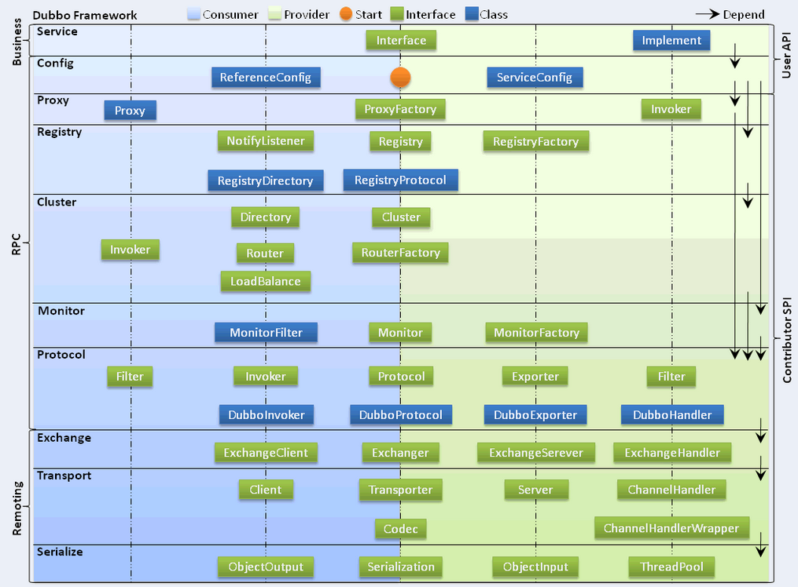
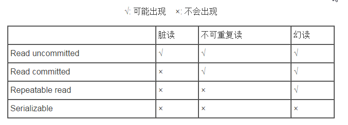
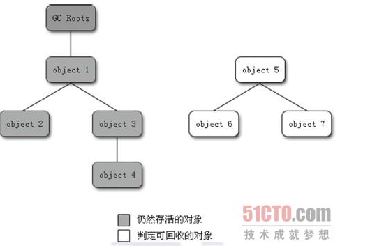
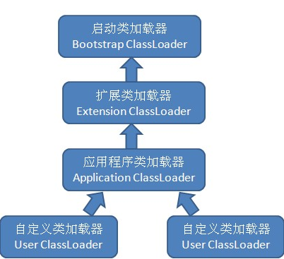

## 有了解过哪些协议？介绍一下三次握手。
TCP协议、HTTP协议、RPC协议
TCP协议三次握手：
1. 客户端向服务端发送一个SYC包
2. 服务端收到SYC包并发送ACK包
3. 客服端收到服务端的ACK包并向其发送SYC包和ACK包

## Collection下面有哪些子类？
List、Set、Map；

## ConcurrentHashMap有了解过吗？
#### 设计思路
ConcurrentHashMap采用了分段锁设计，只有在同一分段内才存在竞态关系，不同的分段锁没有竞争。
ConcurrentHashMap中的分段锁称为Segment，类似于HashMap的结构，即内部拥有一个Entry数组，数组中的每个元素又是一个链表；同时又是一个ReentrantLock。
#### 并发度
同时更新ConcurrentHashMap且不产生锁竞争的最大线程数，实际上就是ConcurrentHashMap中的分段个数。默认并发度为16，

#### 取值原理
先定位到Segment，再定位HashEntry。

## newFixedThreadPool和newCachedThreadPool有什么区别？
Java通过Executors提供四种线程池，分别为：

- newCachedThreadPool 创建一个可缓存线程池，如果线程池长度超过处理需要，可灵活回收空闲线程，若无可回收，则新建线程。

- newFixedThreadPool 创建一个定长线程池，可控制线程最大并发数，超出线程会在队列中等待。

- newScheduleThreadPool 创建一个定长线程池，支持定时及周期性任务执行。

- newSingleThreadExecutor 创建一个单线程化的线程池，它只会用唯一的工作线程来执行任务，保证所有任务按照指定顺序（FIFO、LIFO、优先级）执行。

## StringBuilder和StringBuffer的区别?

String 类型和 StringBuffer 类型的主要性能区别其实在于 String 是不可变的对象, 因此在每次对 String 类型进行改变的时候其实都等同于生成了一个新的 String 对象，StringBuffer则每次都在对象本身进行操作。

## 数据库索引有了解吗？说说他是怎么实现的？

数据库索引，是`数据库管理系统中一个排序的数据结构，以协助快速查询、更新数据库表中数据。索引的实现通常使用B树及其变种B+树`

在数据之外，数据库系统还维护着满足特定查找算法的数据结构，这些数据结构以某种方式引用数据，这样就可以在这些数据结构上实现高级查找算法。这种数据结构就是索引。

## new String()和直接赋值有什么区别？

直接赋值可以创建一个或者不创建对象，如果字符串在Java String池里不存在，会在java String池里创建一个String对象，
new String()至少创建一个对象，也可能两个。因为使用new关键字，肯定会在heap中创建一个String对象。同时如果这个字符串在java String池中不存在，会在String池中创建这个对象。

## HashMap底层是怎么实现的？ArrayList底层怎么实现的？LinkedList底层怎么实现的？LinkedList和ArrayList的区别
#### HashMap
在Java编程语言中，最基本的结构就是两种，一个是数组，另外一个是模拟指针（引用），所有的数据结构都可以用这两个基本结构来构造的，HashMap也不例外。HashMap实际上是一个“链表散列”的数据结构，即数组和链表的结合体。

HashMap底层就是一个数组结构，数组中的每一项又是一个链表。

### ArrayList
ArrayList底层是数组，数组是适合查询的，因为数组每个元素的内存空间是固定的，每次查询时，只需要去查询对应位置的内存空间，就可以很快找到相应的值。而数组不擅长的是添加和删除。

### LinkedList

LinkedList 实际上是通过双向链表去实现的。它包含一个非常重要的内部类：Entry。Entry是双向链表节点所对应的数据结构，它包括的属性有：当前节点所包含的值，上一个节点，下一个节点。

##### LinkedList和ArrayList的区别
ArrayList采用的是数组形式来保存对象的，这种方式将对象放在连续的位置中，所以最大的确定就是插入删除时效率低。
LinkedList采用的是将对象存放在独立的空间中，而且在每个空间中还保存下一个下一个对象的引用，插入和删除效率较高但是缺点就是查找效率低。

## 介绍一下dubbo
Dubbo是阿里公司开源的分布式服务框架，它最大的特点是按照分层的方式来架构，使得各层之间可以最大限度地松耦合。
从服务模型的角度来看，Dubbo采用的是一种非常简单的模型，要么是提供方提供服务，要么是消费方消费服务。



DUbbo框架设计一共划分了10层，Service层是留给实际想要使用Dubbo开发分布式服务的开发者实现业务逻辑的接口层。图中左边淡蓝色背景的为服务消费方使用的接口，右边淡绿色背景的为服务提供方使用的接口，位于中轴线上的为双方都用到的接口。结合Dubbo官方文档，各个层次的设计要点：
 1. 服务接口层（Service）：该层是与实际业务逻辑相关的，根据服务提供方和服务消费方的业务设计对应的接口和实现。
 2. 配置层（Config）：对外配置接口，以ServiceConfig和ReferenceConfig为中心，可以直接new配置类，也可以通过Spring解析配置生成配置类。
 3. 服务代理层（Proxy）：服务接口透明代理，生成服务的客户端Stub和服务端Skeleton，以ServiceProxy为中心，扩展接口为ProxyFactory。
 4. 服务注册层（Registry）：封装服务地址的注册与发行，以服务URL为中心，扩展接口为RegistryFactory、Registry和RegistryService。可能没有服务注册中心，此时服务提供方直接暴露服务。
 5. 集群层（Cluster）：封装多个提供者的路由及负载均衡，并桥接注册中心，以Invoker为中心，扩展接口为Cluster、Directory、Router和LoadBalance。将多个服务提供方组合为一个服务提供方，实现对服务消费方来透明，只需要与一个服务提供方进行交互。
 6. 监控层（Monitor）：RPC调用次数和调用时间监控，以Statistics为中心，扩展接口为MonitorFactory、Moni和MonitorService。
 7. 远程调用层（Protocol）：封装RPC调用，以Invocation和Result为中心，扩展接口为Protocol、Invocer和Exporter。Proto是服务域，他是Invoker暴露和引用的主要功能入口，它负责Invoker的生命周期管理。Invoker是实体域，他是Dubbo的核心模型，其他模型都向他靠拢，或转换成他，他代表一个可执行体，可向他发起invoke调用，他有可能是一个本地的实现，也可能是一个远程的实现，也可能是一个集群实现。
 8. 信息交换层（Exchange）：封装请求响应模式，同步转异步，以Request和Response为中心，扩展接口为Exchanger、ExchangeChannel、ExchangeClient和ExchangeServer。
 9. 网络传输层（Transport):抽象mina和netty为统一接口，以Message为中心，扩展接口为Channel、Transporter、Client、Server和Codec。
 10. 数据序列化层（Serialize）：可复用的一些工具，扩展接口为Serialization、ObjectInput、ObjectOutput和ThreadPool。
 
 10. 有做过ActiveMQ集群吗？
 ActiveMQ是一个完全支持JMS1.1和J2EE 1.4规范的JMS Provider实现。

## 介绍一下内存
根据Java虚拟机规定，Java虚拟机所管理的内存将会包括以下几个运行时数据区域。

- 虚拟机栈：每个方法被执行时，都会创建一个内存空间，用来存储本地方法中的局部变量表，方法的出口等信息。
- 本地方法栈：每个本地方法被执行时，都会创建一个内存空间，用来存储本地方法中的局部变量表，方法的出口等信息。
- 程序计数器：是当前程序锁执行的class文件的行号指示器，通过改变行号指示器来决定下一段要执行的字节码指令，如：跳转、循环、异常处理等。
- 堆： 每一个对象的创建跟分配都是在堆上面进行的，堆分为新生代、老生代。新生代有一个Eden和两个Survivor组成，默认比例是8:2.
    - Young（新生代）：主要用来存放新生的对象。
    - Old（老生代）：主要存放应用程序中生命周期长的内存对象。
    - Permanent（永生代）：是指内存的永久保存区域，主要存放Class和Meta信息，Class在被Load的时候被放入PermGen space区域。它和存放Instance的Heap区域不同，GC
- 方法区：用来存放类的版本，类的方法还有static修饰的对象等信息。

## SpringMVC的执行流程
- SpringMVC将所有的请求都提交给DispatcherServlet，它会委托应用系统的其他模块负责对请求进行真正的处理工作。
- DispatcherServlet查询一个或多个HandlerMapping，找到处理请求的Controller。
- DispatcherServlet将请求提交到目标Controller。
- Controller进行业务逻辑处理后，会返回一个ModelAndView。
- Dispatcher查询一个或多个ViewResolver视图解析器，找到ModelAndView指定的视图对象
- 视图对象负责渲染返回给客户端。

## Spring IOC
IOC -- Inversion Of Control 控制反转，不是什么技术而是一种设计思想。在Java开发中，IOC意味着将你设计好的对象交给容器控制，而不是传统的在你的对象内部直接控制。

- 谁控制谁，控制什么
    传统Java SE程序设计中，我们直接在对象内部通过new进行创建对象，是程序主动去创建依赖对象；而IOC是有专门一个容器来创建这些对象，即由IOC容器来控制对象的创建；
    - 谁控制谁：IOC容器控制了对象。
    - 控制什么： 主要控制了外部资源获取（不只是对象包括文件等）。
- 为何是反转，哪些方面反转了：有反转就有正转，传统应用程序是由我们自己在对象中主动去控制去直接获取依赖对象，也就是正转；而反转则是由容器来帮忙创建及注入依赖对象；
 - 为何是反转：因为容器帮我们查找及注入依赖对象，对象只是被动的接受依赖对象，所以是反转；
 - 哪些方面反转了：依赖对象的获取被反转了。

 IOC对编程带来的最大改变不是从代码上，而是从思想上，发生了“主从换位”的变化。应用程序原本是老大，要获取什么资源都是主动出击，但是在IOC/DI思想中，应用程序就变成被动了，被动的等待IOC容器来创建并注入它所需要的资源了。
 IOC很好的体现了面向对象设计法则之一   好莱坞法则：“Don't call me，I'll Call you”
 即由IOC容器帮对象找相应的依赖对象并注入，而不是由对象主动去找。

 - DI--Dependency Injection 即“依赖注入”：组件之间依赖关系由容器在运行期决定，形象的说，即由容器动态的将某个依赖关系注入到组件之中。依赖注入的目的并非为软件系统带来更多功能，而是为了提升组件的重用评率，并为系统搭建一个灵活、可扩展的平台。通过依赖注入机制，我们只需要通过简单的配置，而无需任何代码就可指定目标需要的资源，完成自身的业务逻辑，而不需要关心具体的资源来自何处，由谁实现。

 #### 理解DI的关键是：谁依赖谁，为什么需要依赖，谁注入谁，注入了什么
 - 谁依赖谁： 应用程序依赖于IOC容器；
 - 为什么需要依赖：应用程序需要IOC容器来提供对象需要依赖的外部资源；
 - 谁注入谁：IOC容器注入应用程序依赖的对象；
 - 注入了什么：注入某个对象所需要的外部资源（包括对象、资源、常量数据）

 #### IOC和DI有什么关系呢？
 其实他们是同一个概念的不同角度描述，由于控制反转概念比较含糊（可能只是理解为容器控制对象这一个层面，很难让人想到谁来维护对象关系），所以2004年大师级人物Martin Fowler又给出了一个新的名字：“依赖注入”，相对IOC而言，“依赖注入”明确描述了“被注入对象依赖IOC容器配置依赖对象”。

 #### 参考链接
 [谈谈对Spring IOC的理解](https://blog.csdn.net/qq_22654611/article/details/52606960/)

 ## AOP
 AOP（Aspect-OrientedProgram，面向切面编程），可以说是OOP的补充和完善。OOP引入封装、继承和多态性等概念来建立一种对象层次结构，用以模拟公共行为的一个集合。当我们需要为分散的对象引入公共行为的时候，OOP则显得无能为力。也就是说，OOP允许你定义从上到下的关系，但并不适合定义从左到右的关系。例如日志功能。日志代码往往水平地散布在所有对象层次中，而与它散布到的对象的核心功能毫无关系。对于其他类型的代码，如安全性、异常处理和透明的持续性也是如此。这种散布在各处的无关的代码被称为横切（cross-cutting）代码，在OOP设计中，它导致了大量代码的重复，而不利于各个模块的重用。

 而AOP技术则恰恰相反，它利用一种称为“横切”的技术，剖解开封装的对象内部，并将那些影响了多个类的公共行为封装到一个可重用模块，并将其名为“Aspect”，即方面。所谓“方面”，简单地说，就是将那些与业务无关，却为业务模块所共同调用的逻辑或责任封装起来，便于减少系统的重复代码，降低模块间的耦合度，并有利于未来的可操作性和可维护性。AOP代表的是一种横向的关系，如果说"对象“是一个空心的圆柱体，其中封装的是对象的属性和行为；那么面向切面编程的方法，就仿佛一把利刃，将这些空心圆柱体剖开，以获得其内部的消息。而剖开的切面，也就是所谓的”方面“了，然后他又以巧夺天工的妙手将这些剖开的切面复原，不留痕迹。

 -----------------
 #### 使用“横切”技术，AOP将软件系统分为两个部分： 核心关注点和横切关注点。
 #### 业务处理的主要流程是核心关注点，与之关系不大的部分是横切关注点。
 横切关注点的一个特点是，他们经常发生在核心关注点的多处，而各处都基本类型。
 比如权限认证、日志、事务处理。AOP的作用在于分离系统中的各种关注点，将核心关注点和横切关注点分离开来。

正如Avande公司的高级方案构架师Adam Magge所说，AOP的核心思想就是“将应用程序中的业务逻辑同对其提供支持的通用服务进行分离。”

实现AOP技术，主要分为两大类：
1. 采用动态代理技术，利用截取消息的方式，对该信息进行装饰，以取代原有对象行为的执行；
2. 采用静态织入的方式，引入特定的语法创建“切面”，从而使得编译器可以在编译期织入有关“切面”的代码。
- 参考链接
[Spring AOP 实现原理](https://blog.csdn.net/moreevan/article/details/11977115/)


## 事务的隔离机制

#### 隔离级别
数据库事务的隔离级别有4个，由低到高依次为Read uncommitted、Read committed、Repeatable read、Serializable。这四个级别可以逐个解决脏读、不可重复读、幻读这几类问题。



1. ISOLATION_READ_UNCOMMITTED:这是事务最低的隔离级别，它允许令外一个事务可以看到这个事务未提交的数据。
2. ISOLATION_READ_COMMITTED:保证一个事务修改的数据提交后才能被另外一个事务读取。另外一个事务不能读取该事务未提交的数据。
3. ISOLATION_REPEATABLE_READ：这种事务隔离级别可以防止脏读，不可重复读。但是可能出现幻读。它除了保证一个事务不能读取另外一个事务未提交的数据外，还保证了避免下面的情况产生（不可重复读）。
4. ISOLATION_SERIALIZABLE：这是花费最高代价但是最可靠的事务隔离级别。事务被处理为顺序执行。除了防止脏读，不可重复读外，还避免了幻读。

#### 传播行为
1. PROPAGATION_REQUIRED：如果当前没有事务，就创建一个新事务，如果当前存在事务，就加入该事务，该设置是最常用的设置。
2. PROPAGATION_SUPPORTS：支持当前事务，如果当前存在事务，就加入该事务，如果当前不存在事务，就以非事务执行。
3. PROPAGATION_MANDATORY:支持当前事务，如果当前存在事务，就加入该事务，如果当前不存在事务，就抛出异常。
4. PROPAGATION_REQUIRES_NEW：创建新事务，无论当前存不存在事务，都创建新事务。
5. PROPAGATION_NOT_SUPPORTED：以非事务方式执行，如果当前存在事务，就把当前事务挂起。
6. PROPAGATION_NEVER：以非事务方式执行，如果当前存在事务，则抛出异常。
7. PROPAGATION_NESTED：如果当前存在事务，则在嵌套事务内执行。如果当前没有事务，则执行以PROPAGATION_REQUIRED类型的操作。

#### 脏读、幻读、不可重复读概念
1. 脏读：
指当一个事务正在访问数据，并且对数据进行了修改，而这种修改还没有提交到数据库中，这时，另外一个事务也访问了这个数据，然后使用了这个数据。
2. 不可重复读：
指在一个事务内，多次读同一个数据。在这个事务还没有结束时，另外一个事务也访问同一数据。那么，在第一个事务的两次读数据之间，由于第二个事务的修改，那么第一个事务两次读到的数据可能是不一样的。这样就发生了在一个事务内两次读到的数据是不一样的，因此成为是不可重复读。（即不能读到相同的数据内容）
例如：一个编辑人员两次读取同一文档，但在两次读取直接，作者重写了该文档。当编辑人员读取文档时，文档已更改。原始读取不可重复。如果只有在作者全部完成编写后编辑人员才可以读取文档，则可以避免该问题。
3. 幻读：
是指当事务不是独立执行时发生的一种现象，例如第一个事务对一个表中的数据进行了修改，这种修改涉及到表中的全部数据行。同时，第二个事务也修改这个表中的数据，这种修改是向表中插入一行新数据。那么，以后就会发生操作第一个事务的用户发现表中还没有修改的数据行，就好像发生了幻觉一样。
例如：一个编辑人员更改作者提交的文档，但当生产部门将其更改内容合并到该文档的主复本时，发现作者已将未编辑的新材料添加到该文档中。如果在编辑人员和生产部门完成对原始文档的处理之前，任何人都不能讲新材料添加到文档中，则可以避免该问题。

##### 参考链接 
[数据库事务隔离级别-- 脏读、幻读、不可重复读（清晰解释）](https://blog.csdn.net/jiesa/article/details/51317164)
[数据事务四种隔离机制和七种传播行为](https://www.cnblogs.com/hq-123/p/6023359.html)

#### 集群
将同一个服务部署多份，同时对外提供相同的服务功能。
#### 分布式
将一个完整复杂的服务，按照业务拆分成多个小服务，分别向外提供不同的服务，降低并发较高业务服务的处理复杂度。

## Redis集群主要有以下两个关注点
1. 稳定性
    1. 服务高可用（HA）当你的主服务节点宕机时，需要有预选方案替代主节点，不会影响系统的整体运行，也就是主从场景下主服务挂了，需要将某一个从服务升为主服务，继续提供服务能力，实际上也就是单点故障的问题。Redis Sentinel 是一个比较好的解决方案。
    2. 数据稳定性  主要是为了保障数据安全，即当一个服务存储设备出现问题时，我还能通过其他的服务恢复数据，其实还是主从场景，从服务会同步主服务的数据，当主服务数据丢失后，还能通过从服务恢复数据。

2. 数据存储问题

    - 服务器的资源限制
    我们都知道，公司的服务器硬件资源都是有限的。比如说内存，一般情况下都在几十G的样子。当我们的热点数据超过单台物理机的硬件资源大小时则无法再提供存储服务，传统的做法是必须再加物理资源，使用Redis集群可以实现数据分片。
### 数据分片
Redis的集群，其实更多意义上来讲还是实现数据分片，即可实现数据的横向扩展（ScaleOut）。数据分片实质就是将一份较大的数据集拆分成多份小的数据集存储到多个机器，可以横向扩展Redis Server的存储容量、传输带宽、计算能力等。常见的分片方案有以下三种：
 1. 客户端分片
客户端分片，顾名思义，就是在客户端完成数据分片的选择，比如数据应该存放在哪个实例（Redis Server），应该从哪个实例进行查询等等操作，常见的实现方案是对Key进行一致性Hash算法得到该Key存储在哪个实例。
 2. 代理服务器分片
相当于在客户端到服务端之间，增加一个代理服务器（Proxy）。客户端可以简单连接到Proxy，当客户端发起请求时，直接请求到Proxy上，再由Proxy去计算操作的Redis Server，那么此时客户端将变得比较简单，但也意味着多经过了一次网络传输。
 3. 服务端分片
服务端分片是Redis3.0版本时推出的集群方案“Redis Cluster”。其原理是客户端可以与任何一个Redis实例通讯，客户端发起请求时连接到一台服务器，而服务器计算key存储在某一个Redis实例上，然后将客户端请求重定向到该实例上，从客户端在该实例完成相应的操作，并获取相应结果。

## 常见的集群方案
1. Redis Sharding + Sentinel 实现高可用集群
该方案就是客户端分片方案
- 原理
对将进行操作的key使用哈希算法进行散列，然后将其映射到对应的Redis节点，这样客户端在进行操作时才知道是对哪个Redis节点进行操作。
1. 采用一致性Hash算法，针对Key + name同时hasing，再与节点进行映射。 key进行hash算法后将其映射到一个hash的环形空间，然后再针对节点名称进行相同的hash算法同时映射到该环形空间，此时key与节点之间的映射关系可以用相邻节点匹配的方式，顺序针找到最近的下一个节点实现映射关系。
2. 在1的基础上保证数据的平衡性，避免节点退出后，导致大量的key都分配到同一节点而造成数据分配不均衡。   用户可以配置节点的权重进一步保证数据分配的合理性。
3. 提供keyTagPattern来调整key的分配策略，以正则表达式的形式，将匹配表达式的key存入同一Redis，这样也可避免针对同类型的key跨节点访问。

为了保证高可用，可引入Redis Sentinel来监控我们Master-Salves节点存活情况，当出现单节点故障问题时，可以基于哨兵的选举算法，推选一个从节点提升为主节点继续提供服务。为我们完成自动故障转移

#### 客户端分片的另一个问题：运行环境的扩容问题。
由于是客户端进行分片，也就意味着客户端再一开始就必须要对已知的服务节点进行管理，那么在生产环境中扩容就会成为比较麻烦的问题。
Redis官方推荐使用预分片方案（Pre-Sharding），大致原理就是根据你的业务情况，预估需要的资源量，然后基于该资源情况去分配你需要多少个Redis节点，在初期用户量不大的情况下，将多个Redis节点部署在一个服务器上，当数据量起来需要扩容时，再将同一台服务器的多个Redis节点部署到新增加的服务器，并将原有Redis节点的数据copy到新的节点上，然后再更新客户端上对应转移的Redis节点的IP和端口，从而实现在线扩容，这种方案只要节点顺序不变，是不会影响一致性哈希分片的。

2. Redis  官方提供的集群方案Redis Cluster
Redis Cluster没有使用一致性哈希的方案，而是引入了哈希槽的概念，可以简单理解为一个个独立数据存储空间，Redis集群一共分配了16384个槽口，通过对每个key进行CRC16校验后，再与16384取模来决定key的存放位置，每一个Redis节点负责一部分的Hash槽。这样的设计对于新增或删除节点也比较友好。更关键的是，此时客户端不再需要做额外的处理，我可以与任何一个Redis节点进行交互，然后再由服务端完成Key的定位，最终重定向到指定节点做相应的处理即可。
3. Twemproxy 中间件实现大规模集群
Twemproxy是Twitter开源的一款Redis集群代理服务应用，作为一个代理服务，它自然是要将原先客户端分片所需要做的事情，承包过来自己完成。它更像是一个Redis Sharding + RedisCluster的一个综合实现，即保持了客户端分片时服务节点的独立性，节点之间互相独立存在，方便线性扩展。也保持了客户端实现的简洁，你不在需要再去考虑分片的策略。
对于客户端来说，只需要像当初链接单Redis节点一样，直接与代理服务通讯，然后由代理服务通过路由规则再讲定位的Redis节点返回给客户端。当然，这种方案下，因为本身Twemproxy也是一个单点的服务，所有为了保证Twemproxy的高可用，你可以采用Twemproxy + keepalived来实现代理服务的高可用。
不过这种方案也有比较大的问题，就是对动态扩容的支持不是特别友好。它支持你动态删除节点，但是被删除节点的数据可能会丢失，你也可以添加节点，但是它不会帮你做已有数据的重新分布。可以使用二级代理的方案去实现客户端无感知的弹性扩容。

4. 支持平滑扩容的集群方案Codis
豌豆荚提供的Redis集群代理服务，它的实现跟Redis Cluster有些类似，同样使用槽的概念，内部划分了1024个槽，通过对Key进行CRC32检验后对1024求模得到槽的id，多个槽被分配到一个Server Group，而一个Server Group管理一个Redis Master和多个Redis Salve。
作为代理服务，它所做的事情与Twemproxy相差不多，但Codis提供的一些特性，也使得Codis成为了更多企业选择的集群方案。如Proxy无状态、平滑扩容、扩容对客户端透明等等，并且还提供了集群的web管理工具。

5. 云服务器所提供的Redis集群服务

---


## 垃圾收集器与内存分配算法

1. 引用计数算法
给对象中添加一个引用计数器，每当有一个地方引用它时，计数器值就加1；当引用失效时，计数器值就减1；任何时刻计数器都为0的对象就是不可能再被使用的。
```
引用计数算法（Reference Counting）的实现简单，判定也很高效，在大部分情况下它都是一个不错的算法，也有一些比较著名的应用案例，例如：微软的COM（Component Object Model）技术、使用ActionScript3的FlashPlayer、Python语言
```
Java中没有选用引用计数算法来管理内存，其中最主要的原因是它很难解决对象之间的相互循环引用的问题。
2. 根搜索算法
通过一系列的名为“GC Roots”的对象作为起点，从这些节点开始向下搜索，搜索所走过的路径称为引用连（Reference Chain），当一个对象到GC Roots没有任何引用链相连（从GC Roots到这个对象不可达）时，则证明此对象是不可用的。

在Java中，可作为GC Roots的对象包括下面几种：
- 虚拟机栈（栈帧中的本地变量表）中的引用的对象。
- 方法区中的类静态属性引用的对象。
- 方法区中常量引用的对象。
- 本地方法栈中JNI（即一般说的Native方法）的引用对象。



#### 再谈引用
无论是通过引用计数算法判断对象的引用数量，还是通过跟搜索算法判断对象的引用链是否可达，判定对象是否存活都与“引用”有关。在JDK1.2之前，Java中的引用的定义很传统：如果Reference类型的数据中存储的数值代表的是另外一块内存的起始地址，就称这块内存代表着一个引用。
在JDK1.2之后，Java对引用的概念进行了扩充，将引用分为强引用（Strong Reference）、软引用（Soft Reference）、弱引用（Weak Reference）、虚引用（Phantom Reference）四种，这四种引用强度依次逐渐减弱。
1. 强引用
指在程序代码之中普遍存在的，类型“Object obj = new Object()”这类引用，只要强引用还存在，垃圾收集器永远不会回收被引用的对象。
2. 软引用
用来描述一些还有用，但并非必须的对象。对于软引用关联着的对象，在系统将要发生内存溢出异常之前，将会把这些对象列进回收范围之中并进行第二次回收。如果这次回收还是没有足够的内存，才会抛出内存溢出异常。在JDK1.2之后，提供了SoftReference类来实现软引用。
3. 弱引用
用来描述非必须的对象，但是它的强度比软引用更弱一些，被弱引用关联的对象只能生存到下一次垃圾收集发生之前。当垃圾收集器工作时，无论当前内存是否足够，都会回收掉只被弱引用关联的对象。在JDK1.2之后，提供了WeakReference类来实现弱引用
4. 虚引用  也称为幽灵引用或者幻影引用
是最弱的一种引用关系。一个对象是否有虚引用的存在，完全不会对其生存时间构成影响，也无法通过虚引用来取得一个对象的实例。为一个对象设置引用关联的唯一目的就是希望能在这个对象被收集器回收时收到一个系统通知。在JDK1.2之后，提供了PhantomReference类来实现虚引用。

#### 生存还是死亡？
在根搜索算法中不可到达的对象，也并非是“非死不可”的，这时候他们暂时处于“缓刑”阶段，要真正宣告一个对象死亡，至少要经历两次标记过程：如果对象在进行根搜索后发现没有与GC Roots相连接的引用链，那么它将会被第一次标记并且进行一次筛选，筛选的条件是此对象是否有必要执行finalize（）方法。当对象没有覆盖finalize（）方法，或者finalize（）方法已经被虚拟机调用过，虚拟机将这两种情况都视为“没有必要执行”。
如果这个对象被判定为有必要执行finalize（）方法，那么这个对象将会被放置在一个名为F-Queue的队列之中，并在稍后由一条虚拟机自动建立的、低优先级的Finalizer线程去执行。这里所谓的”执行“是指虚拟机会触发这个方法，但并不承诺会等待它运行结束。这样做的原因是，如果一个对象在finalize（）方法中执行缓慢，或者发生了死循环，将很可能会导致F-Queue队列中的其他对象永久处于等待状态，甚至导致整个内存回收系统崩溃。finalize（）方法是对象逃脱死亡命运的最后一次机会，稍后GC将对F-Queue中的对象进行第二次小规模的标记，如果对象要在finalize（）中成功拯救自己————只要重新与引用链上的任何一个对象建立关系即可，，譬如：把自己（this关键字）赋值给某个类变量或对象的成员变量，那在第二次标记时它将被移除出“即将回收”的集合；如果对象这时候还没有逃脱，那它就真的离死不远了。

##### 任何一个对象的finalize（）方法都只会被系统自动调用一次，如果对象面临下一次回收，它的finalize（）方法不会被再次执行。

##### finalize（）能做的所有工作，使用try-finally或其他方法都可以做的更好、更及时。

### 回收方法区
很多人认为方法区（或者HotSpot虚拟机中的永久代）是没有垃圾收集的，Java虚拟机规范中确实说过可以不要求虚拟机在方法区实现垃圾收集，而且在方法区进行垃圾收集的“性价比”一般比较低；在堆中，尤其是在新生代中，常规应用进行一次垃圾收集一般可以回收70%~95%的空间，而永久代的垃圾收集效率远低于此。
永久代的垃圾收集主要回收两部分内容：废弃常量和无用的类。回收废弃常量与回收Java堆中的对象非常类似。以常量池中字面量的回收为例，假如一个字符串“abc”已经进入了常量池中，但是当前系统没有任何一个String对象是叫做“abc”的，话句话说是没有任何String对象引用常量池中的“abc”常量，也没有其他地方引用了这个字面量，如果在这时候发生内存回收，而且必要的话，这个“abc”常量就会被系统“请”出常量池。常量池中的其他类（接口）、方法、字段的符号引用也与此类似。
判定一个常量是否是”废弃常量“比较简单，而要判定一个类是否是“无用的类”的条件则相对苛刻许多。类需要同时满足下面三个条件才能算是“无用的类”：
1. 该类所有的实例都已经被回收，也就是Java堆中不存在该类的任何实例。
2. 加载该类的ClassLoader已经被回收。
3. 该类对应的java.lang.Class对象没有在任何地方被引用，无法在任何地方通过反射访问该类的方法。
虚拟机可以对满足上述3个条件的无用类进行回收，这里说的仅仅是“可以”，而不是和对象一样，不使用了就必然会回收。是否对类进行回收，HotSpot虚拟机提供了-Xnoclassgc参数进行控制，还可以使用-verbose：class机-XX：+TraceClassLoading、-XX:+TraceClassUnLoading查看类的加载和卸载信息。-Verbose：class和-XX:+TraceClassLoading可以在Product版的虚拟机中使用，但是-XX：+TraceClassUNLoading参数需要fastdebug版的虚拟机支持。
在大量使用反射、动态代理、CGLib等bytecode框架的场景，以及动态生成JSP和OSGi这类频繁自定义ClassLoader的场景都需要虚拟机具备类卸载的功能，以保证永久代不会溢出。


## 双亲委派模式有了解吗？
Java虚拟机类加载过程是把class类文件加载到内存，并对class文件中的数据进行校验、转换解析和初始化，最终形成可以被虚拟机直接使用的java类型的过程
在加载阶段，java虚拟机需要完成以下3件事：
- 通过一个类的全限定名来获取定义此类的二进制字节流。
- 将定义类的二进制字节流所代表的静态存储结构转换为方法区的运行时数据结构。
- 在java堆中生成一个代表该类的java.lang.Class对象，作为方法区数据的访问入口。
而类的加载过程是通过类加载器完成的。
#### jdk1.2之前
在Java中，任意一个类都需要由加载它的类加载器和这个类本身一同确定其在java虚拟机中的唯一性，即比较两个类是否相等，只有在这两个类是由同一个类加载器加载的前提下才有意义，否则，即使这两个类来源于同一个Class类文件，只要加载它的类加载器不相同，那么这两个类必定不相等（这里的相等包括代表类的Class对象的equals（）方法、isAssignableFrom（）方法、isInstance（）方法和instanceof 关键字的结果）。

#### jdk1.2之后引入双亲委派模型



做一个简单的解释：
1. BootStrap ClassLoader：启动类加载器,负责加载存放在%JAVA_HOME%\bin目录中的，或者通过被-Xbootclasspath参数所指定的路径中的，并且被java虚拟机识别的（仅按照文件名识别，如rt.jar，名字不符合的类库，即使放在指定路径中也不会被加载）类库到虚拟机的内存中，启动类加载器无法被java程序直接引用。
2. Extension ClassLoader：扩展类加载器，由sun.misc.Launcher$ExtClassLoader实现，负责加载%Java_HOME%\lib\ext目录中的，或者被java.ext.dirs系统变量所指定的路径中的所有类库，开发者可以直接使用扩展类加载器。
3. Application ClassLoader：应用程序类加载器，由sum.misc.Launcher$AppClassLoader实现，负责加载用户类路径classpath上所指定的类库，是类加载器ClassLoader中的getSystemClassLoader()方法的返回值，开发者可以直接使用应用程序类加载器，如果程序中没有自定义的类加载器，该加载器就是程序中默认的类加载器。
这里需要注意的是上述三个JDK提供的类加载器虽然是父子类加载器关系，但是没有使用继承，而是使用了组合关系。
从JDK1.2开始，java虚拟机规范推荐开发者使用双亲委派模式（ParentsDelegation Model)进行类加载，其加载过程如下：
1. 如果一个类加载器收到了类加载请求，它首先不会自己去尝试加载这个类，而是把类加载请求委派给父类加载器去完成。
2. 每一层的类加载器都把类加载请求委派给父类加载器，直到所有的类加载请求都应该传递给顶层的启动类加载器。
3. 如果顶层的启动类加载器无法完成加载请求，子类加载器尝试去加载，如果连最初发起类加载请求的类加载器也无法完成加载请求时，将会抛出ClassNotFoundException，而不再调用其子类加载器去进行类加载。

双亲委派模式的类加载机制的优点是java类他的类加载器一起具备了一种带优先级的层次关系，越是基础的类，越是被上层的类加载器进行加载，保证了java程序的稳定运行。

### 多线程相关
a. Java中的Runnable和Callable有什么不同？
Runnable和Callable都代表那些要在不同线程中执行的任务。Runnable从JDK1.0开始就有了，Callable是在JDK1.5增加的。它们的主要区别是Callable的call（）方法可以返回值和抛出异常，而Runnable的run（）方法没有这些功能。Callable可以返回装载有计算结果的Future对象。

参考链接
[Callable,Runnable的区别及用法](https://blog.csdn.net/qq_27258799/article/details/51451143)


---

b. Java中CyclicBarrier 和 CountDownLatch有什么不同
CyclicBarrier 和 CountDownLatch都可以用来让一组线程等待其他线程。与CyclicBarrier不同的是，CountdownLatch不能重新使用。

参考链接
[Java并发编程：CountDownLatch、CyclicBarrier和Semaphore](http://www.cnblogs.com/dolphin0520/p/3920397.html)

---

c. java内存模型是什么

java内存模型规定和指引Java程序在不同的内存架构、CPU和操作系统间有确定性的行为。它在多线程的情况下尤其重要，Java内存模型对一个线程所做的变动能被其他线程可见提供了保证，它们之间是先行发生关系。这个关系定义了一些规则让程序员在并发编程时思路更清晰。比如，先行发生关系确保了：

- 线程内的代码能够按先后顺序执行，这被称为程序次序规则。
- 对于同一个锁，一个解锁操作一定要发生在时间上后发生的另一个锁定操作之前，也叫做管程锁定规则。
- 前一个对volatile的写操作在后一个volatile的读操作之前，也叫volatile变量规则。
- 一个线程内的任何操作必须在这个线程的start（）调用之后，也叫做线程启动规则
- 一个线程的所有操作都会在线程终止之前，线程终止规则。
- 一个对象的终结操作必须在这个对象构造完成之后，也叫做对象终结规则。
- 可传递性

---
d. Java中的volatile变量时什么？
volatile是一个特殊的修饰符，只有成员变量才能使用它。在Java并发程序缺少同步类的情况下，多线程对成员变量的操作对其它线程是透明的。volatile变量可以保证下一个读取操作会在前一个写操作之后发生。

---
e. 什么是线程安全？Vector是一个线程安全类吗？
如果你的代码所在的进程中有多个线程同时运行，而这些线程可能会同时运行这段代码。如果每次运行结果和单线程运行的结果是一样的，而且其他的变量的值也和预期的是一样的，就是线程安全的。一个线程安全的计数器类的同一个实例对象在被多线程使用的情况下也不会出现计算失误。很显然你可以将集合类分为两组，线程安全和非线程安全的。Vector是用同步方法来实现线程安全的，而和它相似的ArrayList不是线程安全的。

---
f. Java中什么是竞态条件？
竞态条件会导致程序在并发情况下出现一些bug。多线程对一些资源的竞争的时候就会产生竞态条件，如果首先要执行的程序竞争失败排到后面执行了，那么整个程序就会出现一些不确定的bug。这种bug很难发现而且会重复出现，因为线程间的随机竞争。

---
g. Java中如何停止一个线程
Java提供了很丰富的API但没有为停止线程提供API。JDK1.0本来有一些像stop（），suspend（）和sesume（）的控制方法，但是由于潜在的死锁威胁，因此在后续的JDK版本中他们都被弃用了。之后Java API的设计就没有提供一个兼容且线程安全的方法来停止一个线程。当run（）或者call（）方法执行完的时候线程会自动结束，如果要手动结束一个线程，可以用volition布尔变量来退出run（）方法的循环或者是取消任务来中断线程。

h. 一个线程运行时发生异常会怎样

简单的说，如果异常没有被捕获该线程将会停止执行。Thread.UncaughtExceptionHandler是用来处理未捕获异常造成线程突然中断情况的一个内嵌接口。当一个未捕获异常将造成线程中断的时候JVM会使用Thread.getUncaughtExceptionHandler（）来查询线程的UNcaughtExceptionHandler并将线程和异常作为参数传递给Handler的UNcaughtException（）方法进行处理。

i. 什么是ThreadLocal变量
ThreadLocal是Java里一种特殊的变量。每个线程都有一个ThreadLocal就是每个线程都拥有了自己独立的一个变量，竞争条件被彻底消除了。它是为创建代价高昂的对象获取线程安全的好方法，比如可以用ThreadLocal让SimpleDateFormat变成线程安全的，因为那个类创建代价高昂且每次调用都需要创建不同的实例所以不值得在局部范围使用它，如果为每个线程提供一个自己独有的变量拷贝，将大大提高效率。首先，通过复用减少了代价高昂的对象的创建个数。其次，在没有使用高代价的同步或者不变性的情况下获得了线程安全。线程局部变量的另一个不错的例子是ThreadLocalRandom类，它在多线程环境中减少了创建代价高昂的Random对象的个数。
 
 ---
 j. 什么是FutureTask
 在Java并发编程中FutureTask表示一个可以取消的异步运算。它有启动和取消运算、查询运算是否完成和取回运算结果等方法。只有当运算完成的时候结果才能取回，如果运算尚未完成get方法将会阻塞。一个FutureTask对象可以对调用了Callable和Runnable的对象进行包装，由于FutureTask也是调用了Runnable接口所以它可以提交给Executor来执行。

 --- 
